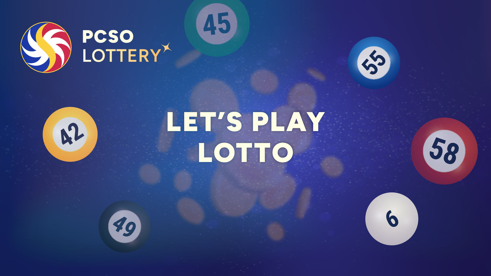

# Lottery Number Generator

A Python application that generates lottery numbers and display lottery results. This application provides a user-friendly interface for generating "lucky" lottery numbers for different lottery types, fetching recent lottery results, and displaying number frequency patterns.



---

## Features

- Generate "lucky" lottery numbers for different lottery types (Ultra Lotto 6/58, Grand Lotto 6/55, etc.)
- Fetch and display recent lottery results from official PCSO website
- Analyze number frequency patterns
- Export data to CSV
- Modern UI with splash screen

---

## 🖼️ Screenshots

| Splash Screen                              | Main Window                                |
|-------------------------------------------|--------------------------------------------|
|  |  |

| Lucky Number Generation                   | Lottery Results                            |
|-------------------------------------------|--------------------------------------------|
|  |  |

---

## Installation

### Prerequisites

- Python 3.6 or higher
- pip (Python package installer)

### Dependencies

The application requires the following Python packages:

- Python 3.6+
- PyQt5 (for the GUI)
- requests (for web scraping)
- beautifulsoup4 (for parsing HTML)

### Installation Steps

1. Clone or download this repository:

```bash
git clone https://github.com/Andott1/Discrete_PIT.git
cd Discrete_PIT
```

1. Install the required dependencies:

```bash
pip install pyqt5 requests bs4
```

or

```bash
pip install -r requirements.txt
```

## Running the Application

To run the application, simply execute the main.py file:

```bash
python main.py
```

or

```bash
.\main.exe # Or run main.exe directly
```

The application will start with a splash screen, followed by the main application window.

## Project Structure

```bash
lottery-number-generator/
├── Assets/                                     # Project asset directory
│   ├── App Screenshots/                        # Screenshots for documentation or preview
│   │   ├── Main Screen Lottery Results.png       # Main screen showing recent results
│   │   ├── Main Screen Lucky Number History.png  # Screenshot showing lucky number history
│   │   ├── Main Screen Lucky Numbers.png         # Screenshot of lucky number generation
│   │   ├── Main Screen Number Frequency.png    # Screenshot of frequency graph/chart
│   │   ├── Main Screen.png                     # General main screen screenshot
│   │   └── Splash Screen.png                   # Screenshot of the splash screen
│   ├── Fonts/                                  # Custom fonts used in the UI
│   │   ├── Roboto_Condensed-Black.ttf
│   │   ├── Roboto_Condensed-Bold.ttf
│   │   ├── Roboto_Condensed-ExtraBold.ttf
│   │   └── ... +13 more .ttf files             # Complete Roboto Condensed font family
│   ├── Icons/                                  # Icons used throughout the UI
│   │   ├── back_icon.png
│   │   ├── down_icon.png
│   │   ├── group_icon.png
│   │   ├── lottery_ball_1.png
│   │   ├── ...
│   │   ├── lottery_ball_6.png                  # Lottery ball icon variations
│   │   ├── next_icon.png
│   │   └── previous_icon.png
│   ├── Resources/                              # Reserved for other asset resources (TBD)
│   └── Screens/                                # Background images and splash visuals
│       ├── splash_screen.png
│       └── main_screen_background.png
├── AssetManager.py                             # Centralized management of asset paths and constants
├── BallWidget.py                               # Builds and manages UI layout for displaying data
├── CircleButtons.py                            # Defines reusable circular button widgets
├── Export.py                                   # Handles exporting of data to CSV
├── FetchLatest.py                              # Scrapes official PCSO results from the web
├── FetchResultsThread.py                       # Background thread to fetch data without freezing the UI
├── LotteryBall.py                              # Main application logic and UI
├── main.py                                     # Entry point for launching the application
├── RoundWidget.py                              # Main round widget content holder
├── SplashScreen.py                             # Manages the main splash screen visuals and logic
├── requirements.txt                            # List of Python dependencies required for the app
└── readme.md                                   # This file
```

## Usage

1. **Select Lottery Type**: Choose from different lottery types (Ultra Lotto 6/58, Grand Lotto 6/55, etc.)
1. **Set Date Range**: Select the date range for fetching lottery results
1. **Generate Lucky Numbers**: Click the "Generate Lucky Numbers" button to generate lucky numbers
1. **View Results**: View the generated numbers, recent results, and frequency analysis
1. **Export Data**: Export the data to a CSV file for further analysis

## Lottery Types Supported

- Ultra Lotto 6/58
- Grand Lotto 6/55
- Superlotto 6/49
- Megalotto 6/45
- Lotto 6/42

## Troubleshooting

### Common Issues

1. **Splash screen doesn't appear**:

- Make sure the splash screen image exists in the assets folder
- Check if the image format is supported (PNG, JPG)
- Try using the simple splash screen implementation

1. **Error fetching lottery results**:

- Check your internet connection
- The website structure might have changed, requiring an update to the scraping code
- Try using a different date range

1. **UI elements appear too small or large**:

- The application scales based on your screen resolution
- Adjust your display scaling settings if needed

### Debug Mode

To run the application in debug mode with additional logging:

```bash
python main.py --debug
```

## Development

### Adding New Lottery Types

To add a new lottery type, update the `LOTTERY_CONFIG` dictionary in `config.py`:

```python
LOTTERY_CONFIG = {
 "New Lottery Type": (min_number, max_number),
 # Existing lottery types...
}
